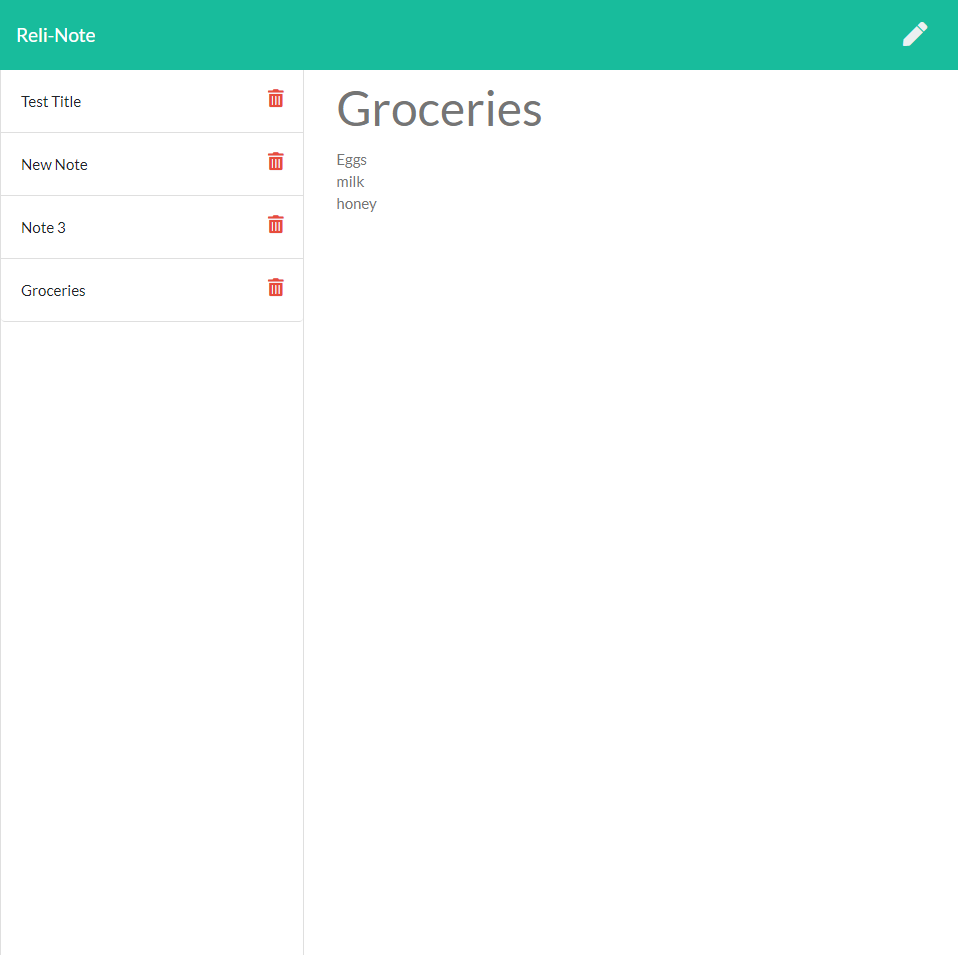

# Reli-Note: The Reliable Note-Taking App

## Description
This is a reliable note-taking app that allows the user to create, save, and view their notes at will.

## Table of Contents
  - [Installation](#installation)
  - [Deployment](#deployment)
  - [Usage](#usage)
  - [Technologies](#technologies)
  - [License](#license)
  - [Next Steps](#next-steps)
  - [Questions](#questions)


## Installation
``` This is a deployed application that can be used by clicking on the deployed application link (in the next section). ```

## Deployment
* Technology used: Heroku
* Deployed Application URL: https://agile-springs-94142.herokuapp.com/

## Usage
Simply click the "Get Started" button to begin on the deployed application. User can choose to view notes in json format on the site by going adding /api/notes to the homepage url.




## Technologies
* HTML5
* CSS3
* JavaScript
* Node.js
* Express.js
* Heroku

## License


  [MIT](https://opensource.org/licenses/MIT)
  

  

## Next Steps
* Edit CSS

## Questions
For additional questions please contact:
* Jayme Mizelle
* Email: jayme.coder@gmail.com
* GitHub: https://github.com/jaymemizelle/
