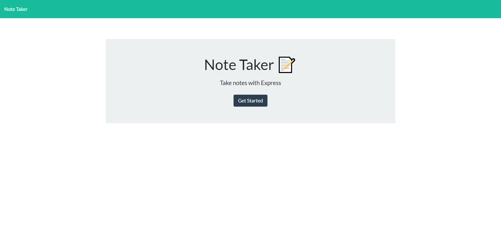

# Reli-Note: The Reliable Note-Taking App

## Description
This is a reliable note-taking app that allows the user to create, save, and view their notes at will.

## Table of Contents
  - [Installation](#installation)
  - [Deployment](#deployment)
  - [Usage](#usage)
  - [License](#license)
  - [Next Steps](#next-steps)
  - [Questions](#questions)


## Installation
``` This is a deployed application that can be used by clicking on the deployed application link. ```

## Deployment

## Usage
Click the "Get Started" button to begin.



## License


  [MIT](https://opensource.org/licenses/MIT)
  

  

## Next Steps
* Edit CSS 

## Questions
For additional questions please contact:
* Jayme Mizelle
* Email: jayme.coder@gmail.com
* https://github.com/jaymemizelle/
